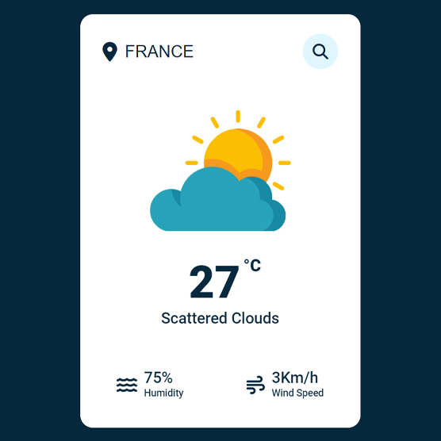

# Stormly - A simple weather app
Stormly is a simple and minimal weather app made with Javacript using the https://openweathermap.org API.

https://stormly.netlify.app

## Warning
You need to get your own api key and replace it in index.js file on line 9 :

```javascript
const APIKey = 'Your Api Key';
```

# Screenshot
Here we have project screenshot :



Website status:

[](https://app.netlify.com/sites/stormly/deploys)
